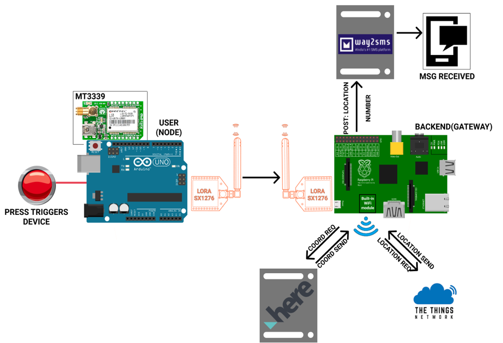

# Proof of concept of wearable for human safety
We intend to do this using the LoRaWAN communication protocol. This is because it has long distance coverage with lower bandwidth which is best suited for sending low memory messages. 

For this version, it has been devised to send a low memory message which contains Gps location upon a small trigger using a button or any kind of signal from a lora node (Arduino). This Gps location received through a lorawan gateway(Raspberry Pi) and sent to cloud(TTN is used for this purpose). the Cloud then accesses here.com through its API to reverse geocode the coordinates, meaning the actual location is retured upon passing the coordinates in the API. The location is then sent to destined mobile number pre-programmed in the server(Raspberry PI), as a message to that number. way2sms.com API is used for sending messages.

As future upgradations, the triger can be changed to any metric (eg. eeg, heart rate) using sensors and the action plan(here sending a message) can be changed to any other process (eg. calling, alerting neighbours etc)

# Block-Diagram

